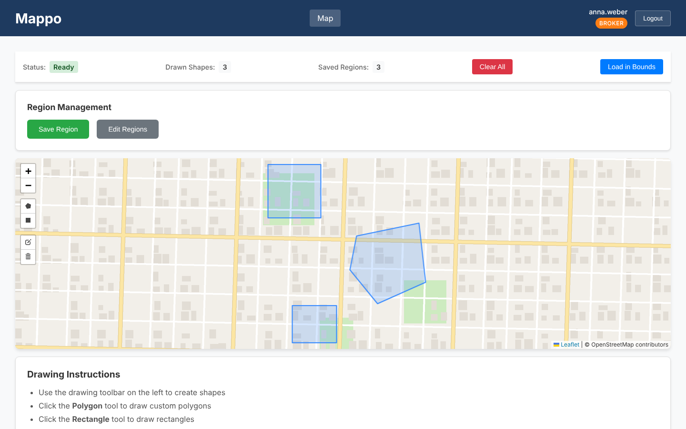
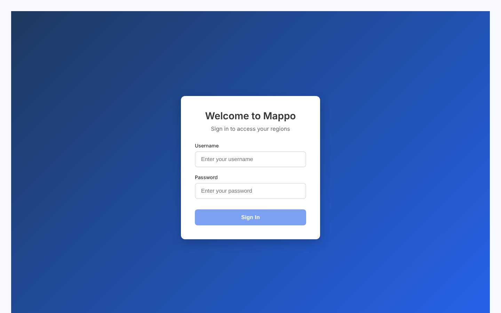
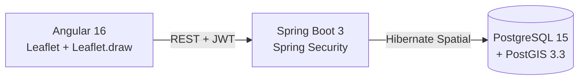

# Mappo

**Map-based region management for real estate brokers.** Brokers draw their areas of interest (neighbourhoods, districts, sales territories) directly on a map, save them, and find them again with spatial queries.

> **Status:** in development. Drawing, saving, loading and role-based access work; region editing and export are planned.

---

## Screenshots





<sub>Screenshots use dummy data and a generated placeholder basemap; the app uses OpenStreetMap tiles.</sub>

---

## Features

- **Draw regions** as polygons or rectangles on an interactive map (Leaflet + Leaflet.draw)
- **Save regions** as GeoJSON — stored as PostGIS geometries
- **Spatial queries** — load only the regions inside the current map view
- **Search** regions by name
- **JWT authentication** with three roles:

| Role | Can do |
|---|---|
| `VIEWER` | View and search regions (read-only) |
| `BROKER` | Create, update and delete regions |
| `ADMIN` | Full access |

Roles are enforced in the backend (`@PreAuthorize`) and reflected in the UI via a custom `*appRole` directive.

---

## Architecture



**Backend** — layered Spring Boot app: controllers → services → JPA repositories. Geometries are converted between GeoJSON and JTS, and spatial lookups use PostGIS functions with a GiST index on the geometry column.

**Frontend** — Angular modules for map, auth and shared UI; an HTTP interceptor attaches the JWT and handles `401` responses; a route guard protects the map.

### API (`/api/v1`)

| Method | Endpoint | Description | Roles |
|---|---|---|---|
| `POST` | `/auth/login` | Log in, returns a JWT | public |
| `GET` | `/regions` | List regions (paginated) | all |
| `GET` | `/regions/{id}` | Get one region | all |
| `GET` | `/regions/search?name=` | Search by name | all |
| `GET` | `/regions/bounds?minX=&minY=&maxX=&maxY=` | Regions inside a bounding box | all |
| `GET` | `/regions/count` | Number of regions | all |
| `POST` | `/regions` | Create a region | ADMIN, BROKER |
| `PUT` | `/regions/{id}` | Update a region | ADMIN, BROKER |
| `DELETE` | `/regions/{id}` | Delete a region | ADMIN, BROKER |

---

## Tech stack

**Backend:** Java 17 · Spring Boot 3.5 · Spring Security · JJWT · Spring Data JPA · Hibernate Spatial · JTS · PostgreSQL 15 + PostGIS 3.3 · Maven
**Frontend:** Angular 16 · TypeScript · Leaflet · Leaflet.draw · RxJS
**Testing:** JUnit 5 · Mockito · Spring Security Test · H2 · Jasmine/Karma
**Infrastructure:** Docker Compose (PostGIS + pgAdmin)

---

## Getting started

### Prerequisites

- Java 17+
- Node.js 18+ and npm
- Docker Desktop

### 1. Configure

```bash
cp .env.example .env    # set DB_PASSWORD, PGADMIN_PASSWORD, JWT_SECRET (≥ 32 chars)
```

Set `DEMO_USER_PASSWORD` if you want demo users (`admin`, `broker`, `viewer`, `testuser`) to be created on startup.

### 2. Start the database

```bash
docker compose up -d db pgadmin4
```

pgAdmin is available at http://localhost:5050.

### 3. Run the backend

The backend reads its settings from environment variables (`DB_PASSWORD`, `JWT_SECRET`, optional `DEMO_USER_PASSWORD`), e.g.:

```bash
cd backend
export $(grep -v '^#' ../.env | xargs)    # Linux/macOS
./mvnw spring-boot:run
```

The API runs at http://localhost:8080/api/v1.

### 4. Run the frontend

```bash
cd mappo
npm install
npm start
```

Open http://localhost:4200 and log in with one of the demo users.

---

## Testing

```bash
cd backend && ./mvnw test     # unit + integration tests (H2)
cd mappo   && npm test        # Jasmine/Karma
```

Unit tests pass; the integration tests (MockMvc + H2) are being reworked.

---

## Project structure

```
mappo/
├── backend/            # Spring Boot API
│   └── src/main/java/com/mappo/backend/
│       ├── controller/ # REST endpoints
│       ├── service/    # business logic
│       ├── repository/ # JPA + spatial queries
│       ├── security/   # JWT filter, role helpers
│       └── model/      # entities
├── mappo/              # Angular app
│   └── src/app/
│       ├── features/map/   # map + drawing
│       ├── services/       # auth, regions, roles
│       ├── interceptors/   # JWT interceptor
│       └── shared/         # role directive, UI
├── init-db.sql         # PostGIS schema
└── docker-compose.yml
```

---

## Roadmap

- [ ] Edit existing regions
- [ ] Export regions (GeoJSON)
- [ ] Rework integration tests
- [ ] CI pipeline
